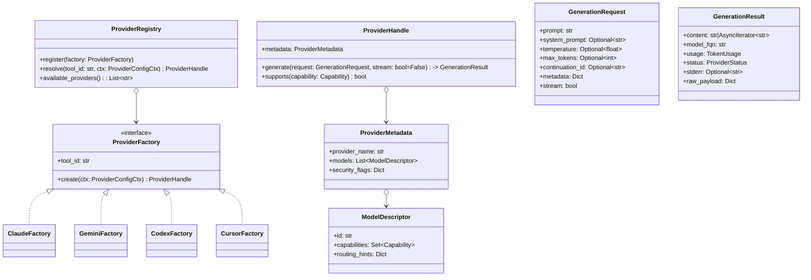

# Architecture Documentation

**Project**: claude-skills
**Version**: 0.5.0
**Generated**: 2025-11-09

> This architecture documentation was generated using AI-enhanced analysis with gemini.
> **Note**: codex was attempted but failed due to requiring an interactive terminal (TTY). Error: "stdout is not a terminal"

---

## 1. System Overview

The **Claude SDD Toolkit** is a Python-based CLI toolkit designed to facilitate "Spec-Driven Development" (SDD). It provides a suite of commands that guide developers through the entire software development lifecycle, from planning and code analysis to implementation, testing, and pull request creation.

The toolkit is heavily integrated with external AI command-line tools (like Gemini, Codex, and Cursor) to automate and assist with complex tasks such as documentation generation, plan reviews, and debugging.

### Target Users
Software developers, especially those who use AI assistants for coding.

### Problem Solved
The toolkit addresses the challenge of keeping AI-assisted development structured, systematic, and trackable by enforcing a "plan-first" workflow based on machine-readable JSON specification files.

---

## 2. Component Architecture

The system is architected as a collection of modular **"skills"**, each corresponding to a CLI subcommand group. All skills are built upon a shared `common` library.

### Core Components

#### **`sdd_plan` (`sdd create`)**
- **Responsibility**: Entry point of the workflow
- **Function**: Creates new SDD specification files from predefined templates (simple, medium, complex)
- **Location**: `src/claude_skills/claude_skills/sdd_plan/`

#### **`sdd_plan_review` (`sdd review`)**
- **Responsibility**: Quality assurance for planning phase
- **Function**: Orchestrates consultations with multiple AI tools to review specs for feasibility, completeness, and potential issues before implementation
- **AI Integration**: Multi-agent consensus approach
- **Location**: `src/claude_skills/claude_skills/sdd_plan_review/`

#### **`code_doc` & `doc_query` (`sdd doc`, `sdd doc-query`)**
- **Responsibility**: Codebase intelligence and analysis
- **Functions**:
  - `code_doc`: Performs static analysis to generate `documentation.json` containing structural information
  - `doc_query`: Provides CLI to query the JSON file (find code, analyze complexity, understand dependencies)
- **Location**: `src/claude_skills/claude_skills/code_doc/`, `src/claude_skills/claude_skills/doc_query/`

#### **`sdd_next` (`sdd next-task`, `sdd prepare-task`)**
- **Responsibility**: Core workflow engine
- **Function**:
  - Reads active spec
  - Determines next unblocked task
  - Checks dependencies
  - Prepares execution plan
  - Uses `doc_query` to automatically provide relevant codebase context
- **Location**: `src/claude_skills/claude_skills/sdd_next/`

#### **`run_tests` (`sdd test`)**
- **Responsibility**: Smart test runner and debugging assistant
- **Function**: Wrapper for `pytest` with presets for common scenarios and AI "consult" feature for diagnosing test failures
- **Location**: `src/claude_skills/claude_skills/run_tests/`

#### **`sdd_fidelity_review` (`sdd fidelity-review`)**
- **Responsibility**: Post-implementation verification
- **Function**: Compares code changes (`git diff`) against original task specification to ensure implementation fidelity
- **AI Integration**: Uses AI tools to perform review
- **Location**: `src/claude_skills/claude_skills/sdd_fidelity_review/`

#### **`sdd_pr` (`sdd create-pr`)**
- **Responsibility**: Pull request generation
- **Function**: Final workflow step that gathers context from spec, git history, and task journals to generate comprehensive PR descriptions
- **AI Integration**: AI-assisted description generation with user approval
- **Location**: `src/claude_skills/claude_skills/sdd_pr/`

#### **`common`**
- **Responsibility**: Shared internal library
- **Functions**:
  - Spec loading and validation
  - AI tool interaction
  - Caching
  - Configuration management
  - CLI output (`PrettyPrinter`)
- **Location**: `src/claude_skills/claude_skills/common/`
- **Underpins**: All other components

### Component Relationships

The components form a clear, sequential workflow:

```
sdd_plan → sdd_plan_review → sdd_next → implementation (using run_tests) → sdd_fidelity_review → sdd_pr
                                ↓
                           code_doc/doc_query (provides context)
```

---

## 3. Data Flow & State Management

### State Management Strategy

**Primary State**: Managed in the filesystem within the `specs/` directory with subdirectories:
- `pending/` - Specs not yet started
- `active/` - Currently in-progress specs
- `completed/` - Finished specs
- `archived/` - Old/deprecated specs

**Project Status**: Determined by:
1. Location of spec file in directory structure
2. `status` field of tasks within the spec (e.g., `"status": "pending"`)

**Benefits**: Entire development state is easily versionable with Git

### Request/Response Lifecycle

1. **User initiates command** (e.g., `sdd next-task <spec-id>`)
2. **Tool loads JSON spec** from `specs/` directory
3. **Business logic execution**:
   - Find next task with `status: "pending"` and no unmet dependencies
4. **AI integration** (for AI-integrated commands like `review`, `consult`):
   - Construct detailed prompt with context from spec/codebase
   - Execute external AI CLI tools as subprocesses
   - Capture and parse `stdout` from AI tools
5. **Result synthesis**:
   - Detect consensus among models (for multi-agent commands)
   - Present results to user or save report (e.g., in `specs/.reviews/`)

### Caching Strategy

**Purpose**: Improve performance and reduce cost of AI consultations

**Implementation**: `CacheManager` in `common` module handles:
- Storing AI consultation results
- Retrieving cached results based on inputs
- TTL-based expiration

---

## 4. Design Patterns

### Command Pattern
- **Usage**: Entire application architecture
- **Implementation**: `argparse` maps subcommands to handler functions
- **Examples**: `create` → `cmd_create`, `review` → `cmd_review`
- **Benefits**: Modular, easily extensible CLI

### Facade Pattern
- **Usage**: Commands that simplify complex operations
- **Example**: `sdd prepare-task` acts as facade for:
  - Load spec
  - Find next task
  - Check dependencies
  - Gather code context
- **Benefits**: Single user action for complex series of operations

### Strategy Pattern
- **Usage**: AI consultation logic
- **Implementation**: Multiple strategies for AI tool selection:
  - Specific tool: `--tool gemini`
  - Auto-routing: `consult_with_auto_routing` selects best-suited tool
- **Location**: `run_tests/consultation.py`
- **Benefits**: Flexible AI tool selection based on problem type

### Factory Pattern
- **Usage**: Language parser instantiation
- **Implementation**: `create_parser_factory` in `claude_skills.code_doc.parsers`
- **Benefits**: Decouples documentation generator from language-specific parsing (Python, JavaScript, etc.)

---

## 5. Technology Stack

### Core Technology
**Python 3** (≥ 3.9)
- Strong scripting support
- Excellent file I/O capabilities
- Vast ecosystem of libraries

### Key Dependencies

#### CLI & Output
- **`argparse`**: Standard library for CLI interface
- **`rich`**: User-friendly terminal output (colors, tables, trees)
  - Evident in `PrettyPrinter` usage
  - Markup: `[red bold]...[/red bold]`

#### Data Validation
- **`jsonschema`**: Validates `documentation.json` structure
  - Ensures data integrity in code documentation

#### Code Analysis
- **`tree-sitter`** family:
  - `tree-sitter-python`
  - `tree-sitter-javascript`
  - `tree-sitter-typescript`
  - `tree-sitter-go`
  - `tree-sitter-html`
  - `tree-sitter-css`

#### External Tool Orchestration
**AI CLI Tools**:
- `gemini`
- `codex` (Note: Requires interactive terminal - not compatible with subprocess capture)
- `cursor-agent`

**Design Decision**: Orchestrate existing AI CLIs rather than integrate with APIs directly
- **Benefits**:
  - Decouples toolkit from specific API SDKs
  - Reuses user's existing tool configurations
- **Trade-offs**:
  - Dependency on user environment having tools installed/configured
  - Some tools (like codex) may not support non-interactive mode

---

## 6. Architectural Decisions

### 1. Filesystem as the "Database"

**Decision**: Store all state in version-controllable JSON files

**Benefits**:
- Simple and transparent
- Portable (no database server needed)
- Version-controllable with Git
- Easy to inspect and debug

**Trade-offs**:
- No support for concurrent multi-user editing
- Potentially slower queries on large number of specs
- Manual file corruption risk

### 2. Orchestration over Integration

**Decision**: Shell out to external CLI tools for AI and Git operations instead of native Python libraries

**Benefits**:
- Simplifies development
- Reuses existing, robust tools
- Leverages user's configured environments

**Trade-offs**:
- Dependency on user's environment
- Tools must be installed and configured
- Subprocess overhead
- **Tool compatibility issues**: Some tools (codex) require TTY and don't support piped I/O

### 3. Multi-Agent Consensus

**Decision**: For critical feedback tasks (plan reviews, fidelity reviews), query multiple AI models and synthesize responses

**Use Cases**:
- Plan reviews
- Fidelity reviews

**Benefits**:
- Higher quality AI-generated feedback
- More reliable results through consensus
- Multiple perspectives reduce bias

**Trade-offs**:
- Slower execution
- Higher cost (multiple API calls)
- **Mitigation**: Caching to reduce repeated costs

### 4. Separation of Analysis and Workflow

**Decision**: Decouple `code_doc`/`doc_query` from main `sdd` workflow tools

**Benefits**:
- Static code analysis can run independently
- Results consumed by multiple components
- More modular architecture
- Clear separation of concerns

**Example**: `sdd_next` uses `doc_query` to gather context, but `code_doc` can be used standalone

---

## 7. Provider Abstraction Blueprint

### 7.1 Goals & Constraints

- **Unify provider contracts** so run-tests, plan-review, and fidelity-review consume the same interface, mirroring ModelChorus’ `ModelProvider` + `GenerationRequest/Response`.
- **Honor consumer expectations** documented in `docs/research/model_chorus_provider_audit.md` and `docs/research/provider_requirements_matrix.md`, especially streaming parity, capability metadata, deterministic model identities, and secure CLI invocation.
- **Remain CLI-first**: implementations still wrap Gemini, Codex, Cursor Agent (and future providers) via subprocess, but encapsulate safety flags, retries, and JSON parsing inside provider modules instead of each skill.

### 7.2 Logical Architecture



**Implementation notes**
- `ProviderHandle.generate()` returns either a buffered `GenerationResult` or, if `stream=True`, exposes an async iterator that yields partial content while continuing to track usage metadata.
- `model_fqn` adopts the `<provider>:<model>` convention so caches, journals, and telemetry remain deterministic when providers change implementation details.

### 7.3 Lifecycle Hooks

1. **Registration** – During CLI boot, each provider module calls `registry.register(factory)` with its tool id (`"gemini"`, `"codex"`, etc.) and dependency checks (binary availability, env vars). Factories advertise capability vectors (text, vision, function-calling, thinking) derived from the ModelChorus audit.
2. **Resolution** – Skills invoke `registry.resolve(tool_id, ctx)`; the registry pulls overrides from `ai_config.resolve_models_for_tools()` plus `.model-chorusrc` defaults, injects security knobs (read-only sandbox, disallowed tools), and emits `ProviderUnavailableError` early so callers can degrade gracefully.
3. **Execution** – `ProviderHandle.generate()` orchestrates request normalization, CLI command construction, subprocess execution with retries/backoff (mirroring ModelChorus `CLIProvider`), and optional streaming. When streaming is enabled the handle emits `ProgressEmitter` events (`model_response`, `cache_save`, etc.) so run-tests can match fidelity-review’s live telemetry.
4. **Result Mapping** – Raw CLI output is parsed into `GenerationResult` with `ProviderStatus` normalized back to the existing `ToolStatus` enum (success, timeout, not_found, invalid_output, error). Consumers retain familiar semantics while gaining richer metadata (token usage, model lineage, raw payloads).

### 7.4 Registry Integration with Existing Skills

- **run-tests** – Auto-routing simply swaps `execute_tools_parallel()` for a registry-backed dispatcher. The skill requests streaming (`stream=True`) to reduce verbosity per the CLI-output audit and still feeds normalized responses into the existing synthesis formatter.
- **sdd-fidelity-review** – Keeps cache logic intact but derives deterministic `model_fqn` strings from `GenerationResult`, eliminating ad-hoc string formatting and ensuring cache keys stay consistent even if provider internals change.
- **sdd-plan-review** – Delegates Gemini JSON wrapper stripping to the Gemini provider, so plan-review only handles normalized Markdown/text and can subscribe to streaming chunks for progress updates without parsing CLI-specific noise.
- **common.ai_tools** – Serves as a compatibility shim translating `GenerationResult` ↔ `ToolResponse` until every skill migrates. This allows incremental rollout without breaking existing commands.

### 7.5 Lifecycle Extension Points

- **`before_execute(request, metadata)`** – For logging/instrumentation hooks that inspect prompts and enforce policy (e.g., secret redaction) before subprocess execution.
- **`on_stream_chunk(chunk, state)`** – Allows ProgressEmitter to broadcast streamed tokens/tool events centrally instead of each skill re-implementing streaming logic.
- **`after_result(result)`** – Centralizes caching, telemetry, and cost accounting so consumers simply opt-in via registry configuration rather than duplicating plumbing.

These hooks reside in the registry layer, ensuring cross-cutting concerns (telemetry, retries, sandbox enforcement) remain consistent regardless of which skill invokes a provider.

---

## Codebase Statistics

- **Total Files**: 159 Python files
- **Total Lines**: 61,192
- **Total Classes**: 114
- **Total Functions**: 749
- **Average Complexity**: 7.09 (Good - within acceptable range)
- **Max Complexity**: 55

### High-Complexity Functions (Refactoring Candidates)

1. `generate_report` - Complexity: 55
2. `complete_task_workflow` - Complexity: 45
3. `update_task_status` - Complexity: 42
4. `execute_verify_task` - Complexity: 39
5. `format_execution_plan` - Complexity: 39

These functions exceed the recommended complexity threshold of 20 and should be considered for refactoring.

---

## Known Issues & Limitations

### AI Tool Compatibility

**Codex CLI Issue**:
- **Problem**: codex requires interactive terminal (TTY) and fails with "stdout is not a terminal" error when used in subprocess mode
- **Impact**: Cannot be used in `sdd doc analyze-with-ai` multi-agent consultation
- **Workaround**: Use gemini or cursor-agent instead
- **Solution**: Request codex maintainers add non-interactive mode support

### Recommendations

For AI-enhanced documentation generation:
- **Recommended tools**: gemini (fast, reliable) or cursor-agent (1M context for large codebases)
- **Avoid**: codex until non-interactive mode is supported

---

## Summary

The SDD Toolkit represents a well-architected, modular CLI system that brings structure and rigor to AI-assisted development. Its filesystem-based state management, orchestration of external tools, and multi-agent AI consultation patterns create a unique approach to spec-driven development that is both transparent and powerful.

The separation of concerns (analysis vs. workflow), clear command patterns, and extensive use of external tool orchestration make the system both maintainable and extensible, while the multi-agent consensus approach ensures high-quality AI assistance throughout the development lifecycle.
