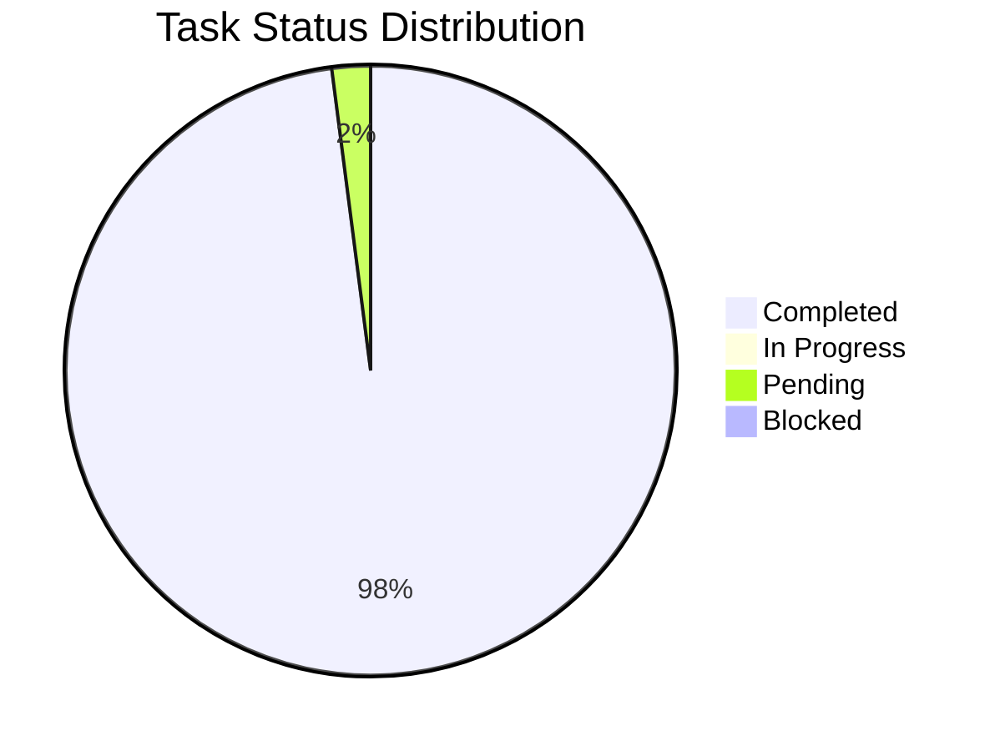

# AI-Enhanced Spec Rendering Skill

**Spec ID:** `ai-enhanced-rendering-2025-10-28-001`  
**Status:** in_progress  
**Progress:** 48/49 tasks (98%)  
**Estimated Effort:** 24.0 hours  
**Complexity:** high  

Create an AI-enhanced rendering skill that transforms JSON specs into intelligent, hierarchical markdown with executive summaries, progressive disclosure, dependency visualization, and narrative flow. Replaces the current simple template-based renderer with context-aware formatting.

## Executive Summary: AI-Enhanced Spec Rendering Skill

### Objectives

This project aims to replace the current template-based specification renderer with an advanced, AI-powered skill. The primary goal is to transform raw JSON specs into intelligent, readable, and actionable markdown documents. Key deliverables include AI-generated executive summaries, visual dependency graphs, and progressive disclosure to improve stakeholder comprehension and development velocity.

### Scope

The scope of this project is the creation and integration of a new `sdd-render` skill. This includes building the core AI analysis engine, developing modules for generating summaries and narrative content, and composing the final enhanced markdown output. The project explicitly maintains compatibility with the existing `sdd render` CLI interface, acting as an enhancement layer on top of the base functionality.

### Key Phases

*   **Phase 1: Foundation & Skill Setup** - Established the new skill's directory structure and integrated it with the toolkit's CLI. (Estimated: 4 hours)
*   **Phase 2: AI Analysis Engine** - Built core components to analyze spec data, identify the critical path, rank task priority, and score complexity. (Estimated: 8 hours)
*   **Phase 3: AI Enhancement Layer** - Implemented AI-powered content generation for executive summaries, narrative transitions, and visual dependency graphs. (Estimated: 6 hours)
*   **Phase 4: Enhanced Markdown Generator** - Assembled all analytical and AI-generated components into a final, coherent markdown document. (Estimated: 4 hours)
*   **Phase 5: Testing & Documentation** - Conducted comprehensive unit and integration testing to ensure production readiness and updated skill documentation. (Estimated: 6 hours)

### Critical Path

The project's critical path follows the sequential completion of its five major phases, as each phase depends on the deliverables of the previous one. The core dependency is the AI analysis engine (Phase 2), which provides the foundational data for all subsequent AI enhancements. A potential bottleneck is the performance of the main AI agent, which can introduce delays during the narrative generation steps.

### Estimated Effort

The total estimated effort for this project is **24 hours**. The project is currently **97% complete**, with 48 out of 49 tasks finished. Based on the last update, the project is expected to be fully completed by the end of day on November 2, 2025.

### Major Risks

*   **Technical Complexity**: The project is rated as **high complexity** due to the integration of multiple AI analysis and generation modules.
*   **AI Performance**: AI agent response times can be slow (30+ seconds), potentially impacting the rendering speed for large specs. Mitigation: The system uses fallbacks to basic rendering if AI enhancements fail or time out.
*   **AI Accuracy**: The quality of generated summaries and narratives is dependent on the main agent's ability to interpret spec data accurately.
*   **External Dependency**: The skill relies on the availability and performance of the main AI agent for its core features.

### Next Steps

*   **Final Documentation Review**: Complete the final pending task (`verify-5-4`) by reviewing the `SKILL.md` documentation for completeness and clarity.
*   **Project Completion**: Mark the final task and the overall spec as complete.
*   **Deployment**: Merge the feature into the main branch for release.


### Quick Stats

- **Progress**: 48/49 tasks (98.0%)
- **Phases**: 5 phases
- **Estimated Effort**: 31.0 hours total
  - Completed: 31.0h
  - In Progress: 0.0h
  - Remaining: 0.0h
- **Status Breakdown**:
  - ✅ Completed: 48
  - 🔄 In Progress: 0
  - ⏸️  Pending: 1
  - 🚧 Blocked: 0


## Objectives

- Generate AI-powered executive summaries with key insights and critical path analysis
- Implement progressive disclosure with collapsible sections and smart detail levels
- Create Mermaid dependency graphs for visualization of task relationships
- Add intelligent task grouping and ordering by priority, risk, and complexity
- Enhance narrative flow to make specs more readable and actionable
- Maintain compatibility with existing sdd render CLI interface
- Use main agent for AI analysis (skill-based approach)

## Visualizations

### Progress Overview



### Dependency Overview

```mermaid
flowchart TD
    phase-1[("Foundation & Skill Setup")]
    phase-1-files[/"File Modifications"/]
    task-1-1["Create sdd_render_skill directory str..."]
    task-1-2["Create SKILL.md for sdd-render"]
    task-1-3["Implement skill_main.py entry point"]
    task-1-4["Register skill in toolkit"]
    phase-1-verify[/"Verification"/]
    phase-2[("AI Analysis Engine")]
    phase-2-files[/"File Modifications"/]
    task-2-1["Create spec_analyzer.py module"]
    task-2-2["Create priority_ranker.py module"]
    task-2-3["Create complexity_scorer.py module"]
    task-2-4["Create insight_generator.py module"]
    task-2-5["Create dependency_graph.py module"]
    task-2-6["Create task_grouper.py module"]
    phase-2-verify[/"Verification"/]
    phase-3[("AI Enhancement Layer")]
    phase-3-files[/"File Modifications"/]
    task-3-1["Create executive_summary.py module"]
    task-3-2["Create progressive_disclosure.py module"]
    task-3-3["Create visualization_builder.py module"]
    task-3-4["Create narrative_enhancer.py module"]
    task-3-5["Create ai_prompts.py module"]
    phase-3-verify[/"Verification"/]
    phase-4[("Enhanced Markdown Generator")]
    phase-4-files[/"File Modifications"/]
    task-4-1["Create markdown_composer.py module"]
    task-4-2["Update skill_main.py orchestration"]
    task-4-3["Add output formatting options"]
    task-4-4["Add error handling and fallbacks"]
    phase-4-verify[/"Verification"/]
    phase-5[("Testing & Documentation")]
    phase-5-files[/"File Modifications"/]
    task-5-1["Create unit tests"]
    task-5-2["Create integration tests"]
    task-5-3["Update SKILL.md with examples"]
    phase-5-verify[/"Verification"/]
    phase-1 --> phase-2
    phase-1 --> phase-2
    phase-1-files --> phase-1-verify
    phase-1-files --> phase-1-verify
    task-1-1 --> task-1-2
    task-1-1 ==> task-1-3
    task-1-1 --> task-1-4
    task-1-1 --> task-1-2
    task-1-1 ==> task-1-3
    task-1-1 --> task-1-4
    task-1-3 ==> task-2-1
    task-1-3 ==> task-2-1
    phase-2 --> phase-3
    phase-2 --> phase-3
    phase-2-files --> phase-2-verify
    phase-2-files --> phase-2-verify
    task-2-1 ==> task-2-2
    task-2-1 --> task-2-3
    task-2-1 ==> task-2-2
    task-2-1 --> task-2-3
    task-2-2 ==> task-3-2
    task-2-2 ==> task-3-2
    task-2-4 --> task-3-1
    task-2-4 --> task-3-1
    task-2-5 --> task-3-3
    task-2-5 --> task-3-3
    task-2-6 --> task-3-2
    task-2-6 --> task-3-2
    phase-3 --> phase-4
    phase-3 --> phase-4
    phase-3-files --> phase-3-verify
    phase-3-files --> phase-3-verify
    task-3-1 --> task-4-1
    task-3-1 --> task-4-1
    task-3-2 ==> task-4-1
    task-3-2 ==> task-4-1
    task-3-3 --> task-4-1
    task-3-3 --> task-4-1
    task-3-4 --> task-4-1
    task-3-4 --> task-4-1
    phase-4 --> phase-5
    phase-4 --> phase-5
    phase-4-files --> phase-4-verify
    phase-4-files --> phase-4-verify
    task-4-1 ==> task-4-2
    task-4-1 ==> task-4-2
    task-4-2 ==> task-4-3
    task-4-2 --> task-4-4
    task-4-2 ==> task-4-3
    task-4-2 --> task-4-4
    phase-5-files --> phase-5-verify
    phase-5-files --> phase-5-verify
    task-5-1 --> task-5-2
    task-5-1 --> task-5-2
    classDef completed fill:#90EE90,stroke:#2E7D32,stroke-width:2px
    class phase-1 completed
    class phase-1-files completed
    class task-1-1 completed
    class task-1-2 completed
    class task-1-3 completed
    class task-1-4 completed
    class phase-1-verify completed
    class phase-2 completed
    class phase-2-files completed
    class task-2-1 completed
    class task-2-2 completed
    class task-2-3 completed
    class task-2-4 completed
    class task-2-5 completed
    class task-2-6 completed
    class phase-2-verify completed
    class phase-3 completed
    class phase-3-files completed
    class task-3-1 completed
    class task-3-2 completed
    class task-3-3 completed
    class task-3-4 completed
    class task-3-5 completed
    class phase-3-verify completed
    class phase-4 completed
    class phase-4-files completed
    class task-4-1 completed
    class task-4-2 completed
    class task-4-3 completed
    class task-4-4 completed
    class phase-4-verify completed
    class phase-5-files completed
    class task-5-1 completed
    class task-5-2 completed
    class task-5-3 completed
    classDef inProgress fill:#FFE082,stroke:#F57C00,stroke-width:2px
    class phase-5 inProgress
    class phase-5-verify inProgress
    classDef critical stroke:#1565C0,stroke-width:4px
    class task-1-1 critical
    class task-4-3 critical
    class task-4-2 critical
    class task-4-1 critical
    class task-2-2 critical
    class task-3-2 critical
    class task-2-1 critical
    class task-1-3 critical
```



## ⚠️  Critical Insights

### Critical bottleneck: task-1-1 blocks 6 tasks

Task task-1-1 blocks 6 other tasks. Delays here will cascade throughout the project.

**Recommendation:** Prioritize task-1-1 immediately. Consider parallel alternatives for dependent tasks.


## Foundation & Skill Setup (6/6 tasks, 100%)

**Purpose:** Set up the new sdd-render skill structure and integrate with existing CLI  
**Risk Level:** low  
**Estimated Hours:** 4.0  

> **Phase Insights:**
> - ⚠️  **Critical bottleneck: task-1-1 blocks 6 tasks**: Task task-1-1 blocks 6 other tasks. Delays here will cascade throughout the project.


### File Modifications (4/4 tasks)

#### ✅ Create sdd_render_skill directory structure - `src/claude_skills/claude_skills/sdd_render_skill/` - (0.5h)

**File:** `src/claude_skills/claude_skills/sdd_render_skill/`  
**Status:** completed  
**Estimated:** 0.5 hours  
**Changes:** Create new skill directory with __init__.py, SKILL.md, and skill_main.py following existing skill patterns  
**Reasoning:** Establish the foundational structure for the new skill following toolkit conventions  

#### ✅ Create SKILL.md for sdd-render - `src/claude_skills/claude_skills/sdd_render_skill/SKILL.md` - (1.0h)

**File:** `src/claude_skills/claude_skills/sdd_render_skill/SKILL.md`  
**Status:** completed  
**Estimated:** 1.0 hours  
**Changes:** Write comprehensive skill documentation explaining purpose, usage, AI enhancement features, and integration with sdd render CLI  
**Reasoning:** Document the skill's capabilities and usage patterns for Claude agents  

**Blocked by:** task-1-1

#### ✅ Implement skill_main.py entry point - `src/claude_skills/claude_skills/sdd_render_skill/skill_main.py` - (1.5h)

**File:** `src/claude_skills/claude_skills/sdd_render_skill/skill_main.py`  
**Status:** completed  
**Estimated:** 1.5 hours  
**Changes:** Create skill entry point that: 1) Validates spec path, 2) Calls existing sdd render CLI for base markdown, 3) Orchestrates AI enhancement pipeline, 4) Outputs enhanced markdown  
**Reasoning:** Establish the main skill workflow that integrates with existing renderer  

**Blocked by:** task-1-1

#### ✅ Register skill in toolkit - `src/claude_skills/claude_skills/__init__.py` - (0.5h)

**File:** `src/claude_skills/claude_skills/__init__.py`  
**Status:** completed  
**Estimated:** 0.5 hours  
**Changes:** Add sdd_render_skill to skill registry and exports  
**Reasoning:** Make the new skill discoverable and invokable via Skill() tool  

**Blocked by:** task-1-1


### Verification (2/2 tasks)

**Blocked by:** phase-1-files  

#### ✅ Skill structure validates

**Status:** completed  
**Type:** auto  

**Command:**
```bash
python -c "from claude_skills.sdd_render_skill import skill_main"
```

**Expected:** Module imports without errors

#### ✅ Skill appears in toolkit

**Status:** completed  
**Type:** manual  

**Command:**
```bash
Check that Skill(sdd-toolkit:sdd-render) is available
```

**Expected:** Skill is registered and invokable


---

_This initial phase establishes the project's core framework and essential skills, creating a solid foundation for all subsequent development. By prioritizing the setup of fundamental tools and command-line interactions, we ensure a robust and consistent structure to support the project's lifecycle. This foundational work is critical for enabling the efficient development of more complex features in later phases._

---

## AI Analysis Engine (12/12 tasks, 100%)

**Purpose:** Build the core AI analysis components that extract insights from specs  
**Risk Level:** medium  
**Estimated Hours:** 8.0  

> **Phase Insights:**
> - ⚠️  **Critical bottleneck: task-1-1 blocks 6 tasks**: Task task-1-1 blocks 6 other tasks. Delays here will cascade throughout the project.


### File Modifications (8/8 tasks)

#### ✅ Create spec_analyzer.py module - `src/claude_skills/claude_skills/sdd_render_skill/spec_analyzer.py` - (2.0h)

**File:** `src/claude_skills/claude_skills/sdd_render_skill/spec_analyzer.py`  
**Status:** completed  
**Estimated:** 2.0 hours  

**Blocked by:** task-1-3
#### ✅ Implement SpecAnalyzer class

**Status:** completed  
**Changes:** Create class that parses JSON spec and builds internal analysis model  
**Reasoning:** Core analyzer that processes spec structure  

#### ✅ Add critical path detection

**Status:** completed  
**Changes:** Implement graph algorithm to identify critical path through dependency tree  
**Reasoning:** Essential for highlighting blocking tasks  

**Blocked by:** task-2-1-1

#### ✅ Add bottleneck detection

**Status:** completed  
**Changes:** Identify tasks with many dependents (high fan-out)  
**Reasoning:** Highlight tasks that block many others  

**Blocked by:** task-2-1-1

#### ✅ Create priority_ranker.py module - `src/claude_skills/claude_skills/sdd_render_skill/priority_ranker.py` - (1.5h)

**File:** `src/claude_skills/claude_skills/sdd_render_skill/priority_ranker.py`  
**Status:** completed  
**Estimated:** 1.5 hours  
**Changes:** Implement multi-factor priority scoring: risk_level weight, dependency count, estimated_hours, task_category, blocking status. Returns ranked task list.  
**Reasoning:** Enable intelligent task ordering in rendered output  

**Blocked by:** task-2-1
#### ✅ Create complexity_scorer.py module - `src/claude_skills/claude_skills/sdd_render_skill/complexity_scorer.py` - (1.0h)

**File:** `src/claude_skills/claude_skills/sdd_render_skill/complexity_scorer.py`  
**Status:** completed  
**Estimated:** 1.0 hours  
**Changes:** Calculate complexity score based on: subtask depth, dependency count, estimated hours, file path patterns  
**Reasoning:** Support adaptive formatting based on task complexity  

**Blocked by:** task-2-1
#### ✅ Create insight_generator.py module - `src/claude_skills/claude_skills/sdd_render_skill/insight_generator.py` - (2.0h)

**File:** `src/claude_skills/claude_skills/sdd_render_skill/insight_generator.py`  
**Status:** completed  
**Estimated:** 2.0 hours  
**Changes:** Extract actionable insights: risk warnings, time estimates, suggested next steps, dependency conflicts, phase completion predictions  
**Reasoning:** Provide AI-generated recommendations and warnings  

**Depends on:** task-2-1, task-2-2
#### ✅ Create dependency_graph.py module - `src/claude_skills/claude_skills/sdd_render_skill/dependency_graph.py` - (1.5h)

**File:** `src/claude_skills/claude_skills/sdd_render_skill/dependency_graph.py`  
**Status:** completed  
**Estimated:** 1.5 hours  
**Changes:** Generate Mermaid flowchart/graph syntax from dependency relationships. Support filtering by phase, critical path highlighting, collapsible subgraphs.  
**Reasoning:** Enable visual dependency understanding  

**Depends on:** task-2-1
#### ✅ Create task_grouper.py module - `src/claude_skills/claude_skills/sdd_render_skill/task_grouper.py` - (1.0h)

**File:** `src/claude_skills/claude_skills/sdd_render_skill/task_grouper.py`  
**Status:** completed  
**Estimated:** 1.0 hours  
**Changes:** Implement smart grouping strategies: by file/directory, by task_category, by risk level, by dependencies. Return grouped task structure.  
**Reasoning:** Support multiple viewing perspectives beyond phase hierarchy  


### Verification (4/4 tasks)

**Blocked by:** phase-2-files  

#### ✅ Critical path detection works

**Status:** completed  
**Type:** auto  

**Command:**
```bash
pytest src/claude_skills/claude_skills/tests/unit/test_sdd_render_skill/test_spec_analyzer.py::test_critical_path
```

**Expected:** Correctly identifies longest dependency chain

#### ✅ Priority ranking is deterministic

**Status:** completed  
**Type:** auto  

**Command:**
```bash
pytest src/claude_skills/claude_skills/tests/unit/test_sdd_render_skill/test_priority_ranker.py
```

**Expected:** Same spec produces same ranking consistently

#### ✅ Mermaid syntax is valid

**Status:** completed  
**Type:** manual  

**Command:**
```bash
Generate graph for test spec and validate at mermaid.live
```

**Expected:** Graph renders without syntax errors

#### ✅ Task grouping covers all tasks

**Status:** completed  
**Type:** auto  

**Command:**
```bash
pytest src/claude_skills/claude_skills/tests/unit/test_sdd_render_skill/test_task_grouper.py::test_complete_coverage
```

**Expected:** Every task appears in exactly one group


---

_With the foundational framework and essential skills now established, the project is prepared for the next stage of development. We will now build the AI Analysis Engine, leveraging these core components to introduce intelligent analysis capabilities. This progression marks the shift from constructing the toolkit to utilizing it for advanced, AI-driven tasks._

---

## AI Enhancement Layer (14/14 tasks, 100%)

**Purpose:** Implement AI-powered content generation for summaries and narrative  
**Risk Level:** medium  
**Estimated Hours:** 6.0  

> **Phase Insights:**
> - ⚠️  **Critical bottleneck: task-1-1 blocks 6 tasks**: Task task-1-1 blocks 6 other tasks. Delays here will cascade throughout the project.

### File Modifications (8/8 tasks)

#### ✅ Create executive_summary.py module - `src/claude_skills/claude_skills/sdd_render_skill/executive_summary.py` - (2.0h)

**File:** `src/claude_skills/claude_skills/sdd_render_skill/executive_summary.py`  
**Status:** completed  
**Estimated:** 2.0 hours  

**Blocked by:** task-2-4

#### ✅ Build summary prompt template

**Status:** completed  
**Changes:** Create prompt that asks agent to summarize: objectives, scope, key phases, critical path, estimated effort, major risks  
**Reasoning:** Generate concise overview for quick understanding  

#### ✅ Integrate with main agent

**Status:** completed  
**Changes:** Call agent with prompt + spec data, parse markdown response  
**Reasoning:** Leverage main agent for intelligent summarization  

**Blocked by:** task-3-1-1

#### ✅ Add key metrics extraction

**Status:** completed  
**Changes:** Extract and format: total/completed tasks, phases, estimated hours, complexity, risk areas  
**Reasoning:** Provide at-a-glance metrics  

**Blocked by:** task-3-1-2
#### ✅ Create progressive_disclosure.py module - `src/claude_skills/claude_skills/sdd_render_skill/progressive_disclosure.py` - (2.0h)

**File:** `src/claude_skills/claude_skills/sdd_render_skill/progressive_disclosure.py`  
**Status:** completed  
**Estimated:** 2.0 hours  

**Blocked by:** task-2-2, task-2-6
#### ✅ Implement detail level calculator

**Status:** completed  
**Changes:** Calculate detail level (summary/medium/full) based on: task status, priority, risk, user context  
**Reasoning:** Determine how much detail to show per section  

#### ✅ Generate collapsible markdown

**Status:** completed  
**Changes:** Use HTML <details><summary> tags for collapsible sections in markdown  
**Reasoning:** Enable progressive disclosure in rendered output  

**Blocked by:** task-3-2-1

#### ✅ Create visualization_builder.py module - `src/claude_skills/claude_skills/sdd_render_skill/visualization_builder.py` - (1.5h)

**File:** `src/claude_skills/claude_skills/sdd_render_skill/visualization_builder.py`  
**Status:** completed  
**Estimated:** 1.5 hours  
**Changes:** Build visualizations: dependency graph (Mermaid), progress charts (ASCII/Mermaid), timeline (Mermaid gantt), category distribution  
**Reasoning:** Generate visual representations of spec structure  

**Blocked by:** task-2-5

#### ✅ Create narrative_enhancer.py module - `src/claude_skills/claude_skills/sdd_render_skill/narrative_enhancer.py` - (2.0h)

**File:** `src/claude_skills/claude_skills/sdd_render_skill/narrative_enhancer.py`  
**Status:** completed  
**Estimated:** 2.0 hours  
**Changes:** Use AI to: add transitional text between phases, explain dependency rationale, suggest implementation order, provide context for decisions  
**Reasoning:** Make specs read more like a story than a list  

**Depends on:** task-2-1
#### ✅ Create ai_prompts.py module - `src/claude_skills/claude_skills/sdd_render_skill/ai_prompts.py` - (1.0h)


### Verification (6/6 tasks)

**Blocked by:** phase-3-files  

#### ✅ Executive summary is concise

**Status:** completed  
**Type:** manual  

**Command:**
```bash
Generate summary for large spec, verify < 500 words
```

**Expected:** Summary captures essence without overwhelming detail

#### ✅ Collapsible sections render correctly

**Status:** completed  
**Type:** manual  

**Command:**
```bash
View rendered markdown in GitHub or markdown previewer
```

**Expected:** Details tags work, content is expandable/collapsible

#### ✅ Visualizations render in markdown

**Status:** completed  
**Type:** manual  

**Command:**
```bash
Check Mermaid graphs render on GitHub/mermaid.live
```

**Expected:** All diagrams display correctly

#### ✅ Narrative flows naturally

**Status:** completed  
**Type:** manual  

**Command:**
```bash
Read enhanced spec, check for smooth transitions
```

**Expected:** Spec reads like coherent document, not fragmented list

#### ✅ AI responses are relevant

**Status:** completed  
**Type:** manual  

**Command:**
```bash
Test with various spec types, verify AI output accuracy
```

**Expected:** Summaries and narratives accurately reflect spec content

#### ✅ Progressive disclosure adapts to context

**Status:** completed  
**Type:** manual  

**Command:**
```bash
Compare output for small vs large specs, verify detail levels differ
```

**Expected:** Large specs show more collapsed sections, small specs more detail


---

_With the AI Analysis Engine providing a comprehensive understanding of the underlying data, we have established a robust analytical foundation. The AI Enhancement Layer will now build upon this foundation, leveraging the insights gained to intelligently augment and refine the system's capabilities. This marks the logical transition from interpreting information to actively improving it._

---

## Enhanced Markdown Generator (10/10 tasks, 100%)

**Purpose:** Assemble all components into final enhanced markdown output  
**Risk Level:** low  
**Estimated Hours:** 4.0  

> **Phase Insights:**
> - ⚠️  **Critical bottleneck: task-1-1 blocks 6 tasks**: Task task-1-1 blocks 6 other tasks. Delays here will cascade throughout the project.

### File Modifications (6/6 tasks)

#### ✅ Create markdown_composer.py module - `src/claude_skills/claude_skills/sdd_render_skill/markdown_composer.py` - (2.0h)

**File:** `src/claude_skills/claude_skills/sdd_render_skill/markdown_composer.py`  
**Status:** completed  
**Estimated:** 2.0 hours  

**Blocked by:** task-3-1, task-3-2, task-3-3, task-3-4
#### ✅ Parse base markdown from sdd render

**Status:** completed  
**Changes:** Read markdown output from sdd render CLI, parse into sections  
**Reasoning:** Use existing renderer as foundation  

#### ✅ Inject AI enhancements

**Status:** completed  
**Changes:** Insert: executive summary at top, visualizations after objectives, narrative transitions between phases, insights in sidebars  
**Reasoning:** Layer AI enhancements onto base markdown  

**Blocked by:** task-4-1-1

#### ✅ Apply progressive disclosure

**Status:** completed  
**Changes:** Wrap appropriate sections in details/summary tags based on detail level calculation  
**Reasoning:** Make large specs more navigable  

**Blocked by:** task-4-1-2
#### ✅ Update skill_main.py orchestration - `src/claude_skills/claude_skills/sdd_render_skill/skill_main.py` - (1.0h)

**File:** `src/claude_skills/claude_skills/sdd_render_skill/skill_main.py`  
**Status:** completed  
**Estimated:** 1.0 hours  
**Changes:** Wire up full pipeline: load spec → call sdd render → analyze → enhance → compose → output  
**Reasoning:** Complete end-to-end skill workflow  

**Blocked by:** task-4-1
#### ✅ Add output formatting options - `src/claude_skills/claude_skills/sdd_render_skill/skill_main.py` - (0.5h)

**File:** `src/claude_skills/claude_skills/sdd_render_skill/skill_main.py`  
**Status:** completed  
**Estimated:** 0.5 hours  
**Changes:** Support output modes: full (all enhancements), summary (executive only), standard (base + narrative)  
**Reasoning:** Give users control over enhancement level  

**Blocked by:** task-4-2
#### ✅ Add error handling and fallbacks - `src/claude_skills/claude_skills/sdd_render_skill/skill_main.py` - (0.5h)

**File:** `src/claude_skills/claude_skills/sdd_render_skill/skill_main.py`  
**Status:** completed  
**Estimated:** 0.5 hours  
**Changes:** Handle: AI failures (fall back to base markdown), invalid specs (use validation), missing dependencies (graceful degradation)  
**Reasoning:** Ensure skill always produces usable output  

**Blocked by:** task-4-2

### Verification (4/4 tasks)

**Blocked by:** phase-4-files  

#### ✅ End-to-end skill invocation works

**Status:** completed  
**Type:** manual  

**Command:**
```bash
Skill(sdd-toolkit:sdd-render) on test spec
```

**Expected:** Enhanced markdown generated successfully

#### ✅ Output replaces base markdown

**Status:** completed  
**Type:** manual  

**Command:**
```bash
Check specs/.human-readable/ contains enhanced version
```

**Expected:** Enhanced markdown saved to standard location

#### ✅ Fallback to base markdown works

**Status:** completed  
**Type:** manual  

**Command:**
```bash
Simulate AI failure, verify base markdown returned
```

**Expected:** Skill gracefully degrades to standard rendering

#### ✅ All output modes function

**Status:** completed  
**Type:** manual  

**Command:**
```bash
Test full, summary, and standard modes
```

**Expected:** Each mode produces appropriate level of enhancement


---

_With the AI Enhancement Layer now operational, we have the foundational intelligence required for advanced content generation. The logical next step is to develop the Enhanced Markdown Generator, which will leverage the AI's capabilities to produce well-structured and human-readable documentation. This phase will focus on translating the powerful but raw output of the AI into a polished and practical format._

---

## Testing & Documentation (6/7 tasks, 86%)

**Purpose:** Comprehensive testing and documentation for production readiness  
**Risk Level:** low  
**Estimated Hours:** 6.0  

> **Phase Insights:**
> - ⚠️  **Critical bottleneck: task-1-1 blocks 6 tasks**: Task task-1-1 blocks 6 other tasks. Delays here will cascade throughout the project.

### File Modifications (3/3 tasks)

#### ✅ Create unit tests - `src/claude_skills/claude_skills/tests/unit/test_sdd_render_skill/` - (3.0h)

**File:** `src/claude_skills/claude_skills/tests/unit/test_sdd_render_skill/`  
**Status:** completed  
**Estimated:** 3.0 hours  
**Changes:** Write tests for: spec_analyzer, priority_ranker, complexity_scorer, dependency_graph, task_grouper, progressive_disclosure  
**Reasoning:** Ensure all analysis components work correctly  

#### ✅ Create integration tests - `src/claude_skills/claude_skills/tests/integration/test_sdd_render_skill/` - (2.0h)

**File:** `src/claude_skills/claude_skills/tests/integration/test_sdd_render_skill/`  
**Status:** completed  
**Estimated:** 2.0 hours  
**Changes:** Test end-to-end: small spec, large spec, spec with complex dependencies, spec with all features  
**Reasoning:** Verify full pipeline produces correct enhanced markdown  

**Blocked by:** task-5-1

#### ✅ Update SKILL.md with examples - `src/claude_skills/claude_skills/sdd_render_skill/SKILL.md` - (1.0h)


### Verification (3/4 tasks)

**Blocked by:** phase-5-files  

#### ✅ All unit tests pass

**Status:** completed  
**Type:** auto  

**Command:**
```bash
pytest src/claude_skills/claude_skills/tests/unit/test_sdd_render_skill/ -v
```

**Expected:** All tests pass with >80% coverage

#### ✅ Integration tests pass

**Status:** completed  
**Type:** auto  

**Command:**
```bash
pytest src/claude_skills/claude_skills/tests/integration/test_sdd_render_skill/ -v
```

**Expected:** End-to-end workflows complete successfully

#### ✅ Test with real specs

**Status:** completed  
**Type:** manual  

**Command:**
```bash
Run skill on existing specs in specs/completed/
```

**Expected:** Enhanced markdown is improvement over original

#### ⏳ Documentation is complete

**Status:** pending  
**Type:** manual  

**Command:**
```bash
Review SKILL.md completeness
```

**Expected:** All features documented with examples
